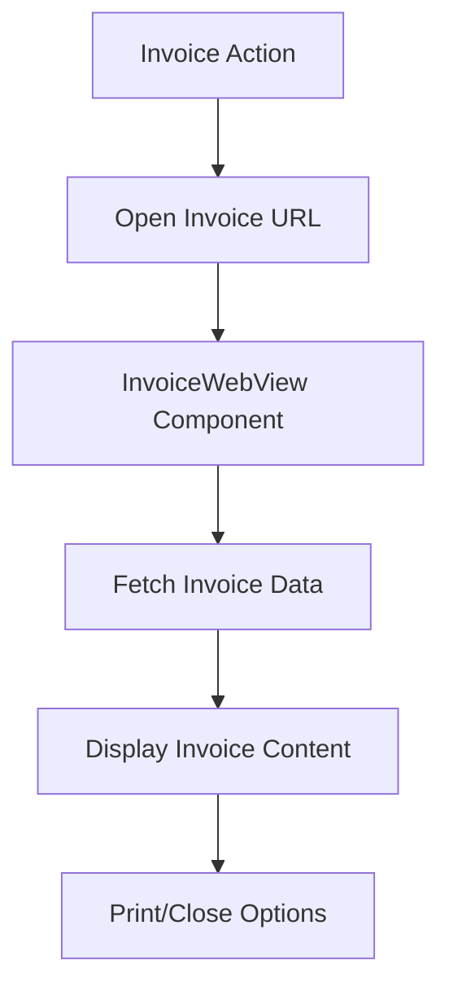

# Invoice Generator App

This is a modern Invoice Generator application built with Next.js, React, TypeScript, and Shadcn UI. It allows you to create professional invoices by managing customers and products, calculating totals including GST, and generating web-based invoices for viewing and printing.

The project is designed with modern practices, including TypeScript for type safety, separation of concerns for maintainability and testability, and a responsive web-based invoice viewing system.

## 🚀 Quick Start

### ⚡ Quick Development Setup

For the fastest setup, use our automated script:
```bash
git clone <repository-url>
cd bakery-invoice-generator
./setup.sh             # Automated setup (installs deps, creates env files, sets permissions)
./dev.sh               # Start development server
```

Or validate existing configuration:
```bash
./validate-config.sh   # Check configuration consistency
```

### Prerequisites

- **Node.js 18+** (Recommended: Node.js 22)
- **npm** or **yarn**
- **Docker & Docker Compose** (for containerized development)

### Local Development (Without Docker)

1. **Clone the repository:**
   ```bash
   git clone <repository-url>
   cd bakery-invoice-generator
   ```

2. **Install dependencies:**
   ```bash
   npm install
   ```

3. **Create environment file:**
   ```bash
   cp .env.example .env.dev
   # or create manually with default values:
   echo "PORT=9002" > .env.dev
   echo "NODE_ENV=development" >> .env.dev
   ```

4. **Start the development server:**
   ```bash
   # Option 1: Use the development script (recommended)
   ./dev.sh
   
   # Option 2: Load environment and run manually
   source .env.dev && npm run dev
   
   # Option 3: Use npm script (requires manual env loading)
   npm run dev:script
   ```

5. **Access the application:**
   Open [http://localhost:${PORT}](http://localhost:9002) in your browser (default: 9002)

### Docker Development (Recommended)

1. **Clone the repository:**
   ```bash
   git clone <repository-url>
   cd bakery-invoice-generator
   ```

2. **Create environment file:**
   ```bash
   cp .env.example .env.dev
   # or create manually with default values:
   echo "PORT=9002" > .env.dev
   echo "NODE_ENV=development" >> .env.dev
   ```

3. **Start with Docker Compose:**
   ```bash
   docker-compose up --build
   ```

4. **Access the application:**
   Open [http://localhost:${PORT}](http://localhost:9002) in your browser (uses PORT from .env.dev)

## 🧪 Testing

### Run All Tests
```bash
npm test
```

### Run Tests with UI
```bash
npm run test:ui
```

### Type Checking
```bash
npm run typecheck
```

### Linting
```bash
npm run lint
```

### Code Formatting
```bash
npm run pretty
```

## 🏗️ Building for Production

### Local Build
```bash
# Option 1: Use the production script (recommended)
./start.sh

# Option 2: Manual build and start
source .env.prod && npm run build && npm run start

# Option 3: Use npm scripts
npm run build
npm run start:script
```

### Docker Production Build
The Dockerfile uses multi-stage builds for optimized production images:
```bash
# Build with production environment variables
docker build --build-arg PORT=3000 -t invoice-generator .
# Run with environment variables
docker run -p ${PORT:-3000}:${PORT:-3000} -e PORT=${PORT:-3000} invoice-generator
```

## 📋 Environment Variables

The application uses environment variables for configuration. Create the appropriate `.env` file based on your environment:

### Development (.env.dev)
```bash
PORT=9002                # Development server port
NODE_ENV=development     # Environment mode
```

### Production (.env.prod)
```bash
PORT=3000               # Production server port
NODE_ENV=production     # Environment mode
```

### Available Variables
- **PORT**: Server port (default: 9002 for dev, 3000 for prod)
- **NODE_ENV**: Environment mode (development/production)

## 🚀 Startup Methods

### Development
1. **Script method (recommended)**: `./dev.sh` - Automatically loads `.env.dev`
2. **Docker method**: `docker-compose up --build` - Uses `.env.dev` file
3. **Manual method**: `source .env.dev && npm run dev` - Manual env loading
4. **Direct method**: `PORT=9002 npm run dev` - Inline environment variables

### Production
1. **Script method (recommended)**: `./start.sh` - Automatically loads `.env.prod`
2. **Docker method**: `docker build -t app . && docker run -p 3000:3000 --env-file .env.prod app`
3. **Manual method**: `source .env.prod && npm run build && npm run start`

## 🔧 Troubleshooting

### Configuration Validation

Before troubleshooting, validate your configuration:
```bash
# Run the configuration validator
./validate-config.sh

# Or use npm script
npm run validate-config
```

This will check:
- Environment files existence and content
- Port consistency across configurations
- Required scripts and permissions
- Essential files presence

### Common Issues

#### 1. Port Already in Use
**Error:** `EADDRINUSE: address already in use :::${PORT}`
**Solution:**
```bash
# Kill process using the port (replace ${PORT} with actual port number)
lsof -ti:${PORT} | xargs kill -9
# Or change the port in your .env file
echo "PORT=9003" > .env.dev
# Or use a different port for one session
PORT=9003 npm run dev
```

#### 2. Web Invoice Display Issues
**Error:** Invoice not rendering correctly, data not loading, or print functionality errors.
**Solutions:**
- Check browser console for JavaScript errors.
- Ensure `src/lib/fonts/` directory exists if custom web fonts are used and not loading.
- Verify component props and data flow for invoice components.
- Test print functionality in different browsers if issues are browser-specific.

#### 3. TypeScript Compilation Errors
**Solution:**
```bash
# Clear Next.js cache
rm -rf .next
# Clear TypeScript build info
rm -f tsconfig.tsbuildinfo
# Reinstall dependencies
rm -rf node_modules package-lock.json
npm install
```

#### 4. Docker Issues
**Problem:** Permission denied errors in Docker
**Solution:**
```bash
# Ensure proper permissions for data directories
sudo chown -R 1000:1000 src/lib/data/
```

**Problem:** Docker Compose not reflecting changes
**Solution:**
```bash
# Rebuild containers
docker-compose down
docker-compose up --build
```

### Debug Mode

Enable detailed logging by setting environment variables:
```bash
export NODE_ENV=development
export DEBUG=*
# Or add to your .env.dev file:
echo "DEBUG=*" >> .env.dev
```

### Invoice Viewing Debug

Check web invoice viewing status:
1. Navigate to `/invoices` page (or the relevant page for listing invoices, e.g., `/receipts` if the route hasn't been renamed yet)
2. Create a new invoice
3. Click "View Invoice" (or similar button) to open the web view
4. Monitor browser console for any loading or display issues

### Port Configuration

The application uses the `PORT` environment variable from multiple sources:
- **Environment files**: `.env.dev` (development) or `.env.prod` (production)
- **Docker**: Uses PORT from environment file via docker-compose
- **Scripts**: `./dev.sh` and `./start.sh` automatically load correct environment
- **Manual override**: `PORT=<number> npm run dev` or `PORT=<number> ./dev.sh`

### Script Permissions

If you get permission errors with the startup scripts:
```bash
chmod +x dev.sh start.sh
```

### Environment File Management

- **Copy template**: `cp .env.example .env.dev` or `cp .env.example .env.prod`
- **Check current config**: `cat .env.dev` or `cat .env.prod`
- **Validate environment**: `source .env.dev && echo "Port: $PORT, Environment: $NODE_ENV"`

## 📚 Technologies Used

### Core Framework
- **Next.js 15.3.3** - React framework with App Router
- **React 18** - UI library
- **TypeScript 5.8+** - Type-safe JavaScript

### UI & Styling
- **Shadcn UI** - Component library built on Radix UI
- **Tailwind CSS 3.4+** - Utility-first CSS framework
- **Lucide React** - Icon library

### Development Tools
- **Vitest 3.1.4** - Fast unit testing framework
- **ESLint** - Code linting
- **Prettier** - Code formatting
- **Docker** - Containerization

### Data & Validation
- **Zod** - TypeScript-first schema validation
- **Date-fns** - Modern date utility library
- **UUID** - Unique identifier generation

## 🏛️ Technical Architecture

### Project Structure

```
src/
├── app/                    # Next.js App Router pages
│   ├── api/               # API routes
│   ├── customers/         # Customer management page
│   ├── products/          # Product management page
│   ├── invoices/          # Invoice page (previously receipts)
│   └── settings/          # Settings page
├── components/ui/         # Reusable UI components (Shadcn)
├── lib/
│   ├── actions/          # Server actions (data operations)
│   ├── data/             # JSON data storage
│   ├── data-access/      # Data access layer
│   ├── services/         # Business logic services (if any, review if PDF related)
│   └── fonts/            # Font files for display (if used by web UI)
└── hooks/                # Custom React hooks
```

### Web Invoice Architecture

The application uses a web-based invoice viewing system:

#### Key Components

1. **InvoiceWebView Component** (`src/components/invoices/InvoiceWebView.tsx` or similar, needs verification)
   - Main component for displaying invoices in web format
   - Handles invoice data fetching and error states
   - Provides responsive design for various screen sizes

2. **InvoiceContent Component** (`src/components/invoices/components/InvoiceContent.tsx` or similar, needs verification)
   - Renders the formatted invoice layout
   - Handles business and individual customer display
   - Calculates and displays GST and totals

3. **PrintToolbar Component** (`src/components/invoices/components/PrintToolbar.tsx` or similar, needs verification)
   - Provides print and close functionality
   - Hidden during print mode for clean output
   - Allows easy window management

4. **Invoice Components** (`src/components/invoices/components/` or similar, needs verification)
   - Modular components for different invoice sections
   - Includes customer info, seller info, items table, and totals
   - Reusable across different invoice views

#### Invoice Viewing Flow



### Data Flow

1. **User Input** → Forms on frontend pages
2. **Server Actions** → Handle form submissions and business logic
3. **Data Access Layer** → Manages JSON file operations
4. **Web Invoice Display** → Shows invoices in browser for viewing and printing
5. **Data Storage** → Saves invoice data to JSON files

### Configuration

#### Environment Variables
- `PORT` - Application port (default: 9002)
- `NODE_ENV` - Environment mode (development/production)

## 🔄 Development Workflow

### Adding New Features

1. **Create types** in `src/lib/types.ts`
2. **Add data access methods** in `src/lib/data-access/`
3. **Implement server actions** in `src/lib/actions/`
4. **Create UI components** using Shadcn patterns
5. **Add tests** for new functionality

### Code Quality

The project enforces code quality through:
- **TypeScript** strict mode for type safety
- **ESLint** for code linting with Next.js recommended rules
- **Prettier** for consistent code formatting
- **Vitest** for comprehensive testing

### Deployment Considerations

- **Environment Variables**: Ensure all required env vars are set.
- **File System Access**: Ensure the application has necessary permissions if it needs to read/write files (e.g., for data storage if not using a database).
- **Memory**: Ensure adequate memory allocation for the Node.js process.
- **Web Fonts**: If custom fonts are used, ensure they are correctly configured and accessible in production builds.

## 🤝 Contributing

1. Fork the repository
2. Create a feature branch: `git checkout -b feature/your-feature`
3. Make changes and add tests
4. Run quality checks: `npm run lint && npm run typecheck && npm test`
5. Commit changes: `git commit -m "Add your feature"`
6. Push to branch: `git push origin feature/your-feature`
7. Create a Pull Request

## 📝 License

This project is licensed under the MIT License.


