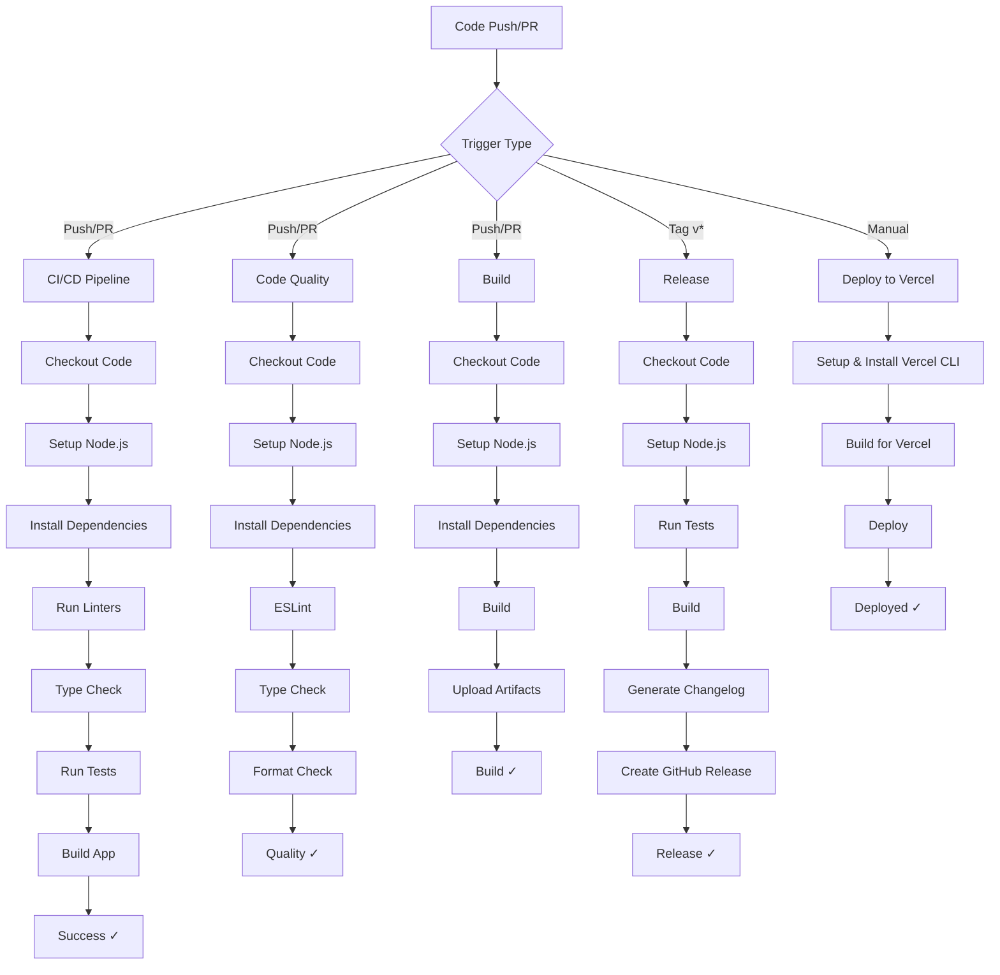
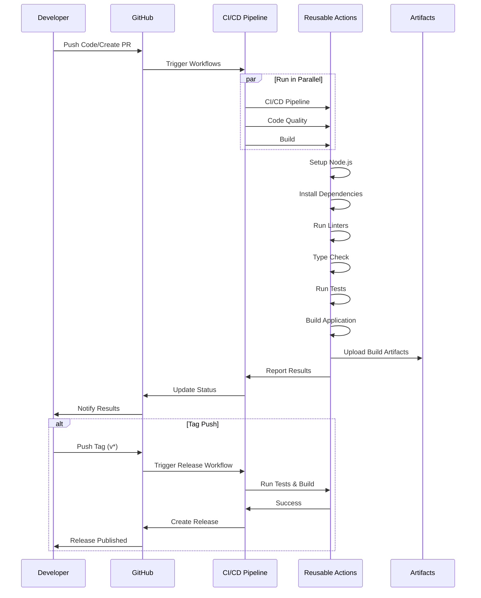

# CI/CD Pipelines Documentation

This document describes the CI/CD pipelines implemented for the Bakery Invoice Generator project. The pipelines are designed to ensure code quality, automated testing, and streamlined deployments.

## Table of Contents

- [Overview](#overview)
- [Pipeline Architecture](#pipeline-architecture)
- [Workflows](#workflows)
- [Reusable Actions](#reusable-actions)
- [Workflow Triggers](#workflow-triggers)
- [Status Badges](#status-badges)
- [Setup Instructions](#setup-instructions)

## Overview

The project uses GitHub Actions for CI/CD automation. The pipeline architecture follows best practices with:

- **Reusable Actions**: Common tasks packaged as reusable GitHub Actions
- **Modular Workflows**: Separate workflows for different concerns (testing, quality, builds, releases)
- **Automated Releases**: Release creation triggered by git tags
- **Deployment Ready**: Vercel deployment workflow (can be activated when needed)

## Pipeline Architecture

### High-Level Pipeline Flow



### Detailed Workflow Execution



## Workflows

### 1. CI/CD Pipeline (`test.yml`)

**Purpose**: Main continuous integration pipeline that runs comprehensive checks.

**Triggers**:
- Push to `main` or `master` branches
- Pull requests to `main` or `master` branches

**Steps**:
1. Checkout code
2. Setup Node.js environment with caching
3. Install dependencies
4. Run ESLint linters
5. Run TypeScript type checking
6. Execute test suite
7. Build the application

**Badge**: 
```markdown

```

### 2. Code Quality (`code-quality.yml`)

**Purpose**: Dedicated workflow for code quality checks.

**Triggers**:
- Push to `main` or `master` branches
- Pull requests to `main` or `master` branches

**Steps**:
1. Checkout code
2. Setup Node.js environment
3. Install dependencies
4. Run ESLint checks
5. Run TypeScript type checks
6. Check code formatting with Prettier

**Badge**: 
```markdown

```

### 3. Build (`build.yml`)

**Purpose**: Verify that the application builds successfully and archive build artifacts.

**Triggers**:
- Push to `main` or `master` branches
- Pull requests to `main` or `master` branches

**Steps**:
1. Checkout code
2. Setup Node.js environment
3. Install dependencies
4. Build Next.js application
5. Archive and upload build artifacts (retained for 7 days)

**Badge**: 
```markdown

```

### 4. Release (`release.yml`)

**Purpose**: Automated release creation when version tags are pushed.

**Triggers**:
- Push of tags matching `v*.*.*` pattern (e.g., v1.0.0, v2.1.3)

**Steps**:
1. Checkout code with full history
2. Setup Node.js environment
3. Run test suite
4. Build application
5. Extract version from tag
6. Create release archive (.tar.gz)
7. Generate changelog from git commits
8. Create GitHub release with artifacts
9. Mark as prerelease if version contains hyphen (e.g., v1.0.0-beta)

**Badge**: 
```markdown

```

**Usage**:
```bash
# Create and push a tag
git tag v1.0.0
git push origin v1.0.0

# For prerelease
git tag v1.0.0-beta
git push origin v1.0.0-beta
```

### 5. Deploy to Vercel (`deploy-vercel.yml`)

**Purpose**: Deploy application to Vercel (DEACTIVATED by default).

**Current Trigger**:
- Manual workflow dispatch only

**When Activated, can trigger on**:
- Push to specified branches
- Pull requests
- Manual dispatch

**Steps**:
1. Checkout code
2. Setup Node.js environment
3. Install Vercel CLI
4. Pull Vercel environment configuration
5. Build project artifacts for Vercel
6. Deploy to Vercel
7. Comment deployment URL on PR (if applicable)

**Activation Instructions**:
See the [Deploy to Vercel Setup](#deploy-to-vercel-setup) section below.

## Reusable Actions

The project includes custom reusable GitHub Actions located in `.github/actions/`:

### 1. Setup Node.js (`setup-node`)

**Purpose**: Configure Node.js environment with dependency caching and installation.

**Inputs**:
- `node-version` (optional): Node.js version to use (default: '18')
- `install-dependencies` (optional): Whether to install dependencies (default: 'true')

**Usage**:
```yaml
- name: Setup Node.js Environment
  uses: ./.github/actions/setup-node
  with:
    node-version: '18'
```

### 2. Lint (`lint`)

**Purpose**: Run ESLint code linting.

**Usage**:
```yaml
- name: Run Linters
  uses: ./.github/actions/lint
```

### 3. Type Check (`typecheck`)

**Purpose**: Run TypeScript type checking.

**Usage**:
```yaml
- name: Run Type Checking
  uses: ./.github/actions/typecheck
```

### 4. Test (`test`)

**Purpose**: Execute the test suite.

**Usage**:
```yaml
- name: Run Tests
  uses: ./.github/actions/test
```

### 5. Build (`build`)

**Purpose**: Build the Next.js application.

**Usage**:
```yaml
- name: Build Application
  uses: ./.github/actions/build
```

## Workflow Triggers

### Branch Protection

The workflows are configured to run on:
- `main` branch
- `master` branch

### Event Types

| Workflow | Push | Pull Request | Tag | Manual |
|----------|------|--------------|-----|--------|
| CI/CD Pipeline | ✓ | ✓ | - | - |
| Code Quality | ✓ | ✓ | - | - |
| Build | ✓ | ✓ | - | - |
| Release | - | - | ✓ | - |
| Deploy to Vercel | - | - | - | ✓ |

## Status Badges

Add these badges to your README.md to display pipeline status:

```markdown
## CI/CD Status

[](https://github.com/Romerolweb/bakery-invoice-generator/actions/workflows/test.yml)
[](https://github.com/Romerolweb/bakery-invoice-generator/actions/workflows/code-quality.yml)
[](https://github.com/Romerolweb/bakery-invoice-generator/actions/workflows/build.yml)
[](https://github.com/Romerolweb/bakery-invoice-generator/actions/workflows/release.yml)
```

## Setup Instructions

### Basic Setup

The CI/CD pipelines work out of the box with no additional configuration required for:
- CI/CD Pipeline
- Code Quality checks
- Build verification
- Automated releases

### Deploy to Vercel Setup

The Vercel deployment workflow is **deactivated by default**. To activate it:

1. **Create Vercel Account and Link Repository**
   - Sign up at [vercel.com](https://vercel.com)
   - Import your GitHub repository

2. **Get Vercel Credentials**
   - **VERCEL_TOKEN**: 
     - Go to Vercel Dashboard → Settings → Tokens
     - Create a new token with appropriate permissions
   - **VERCEL_ORG_ID**: 
     - Found in your Vercel team/organization settings
   - **VERCEL_PROJECT_ID**: 
     - Found in your project settings

3. **Add Secrets to GitHub**
   - Go to Repository Settings → Secrets and variables → Actions
   - Click "New repository secret"
   - Add these three secrets:
     - `VERCEL_TOKEN`
     - `VERCEL_ORG_ID`
     - `VERCEL_PROJECT_ID`

4. **Activate Automatic Deployment** (Optional)
   
   Edit `.github/workflows/deploy-vercel.yml` and replace:
   ```yaml
   on:
     workflow_dispatch:
   ```
   
   With:
   ```yaml
   on:
     push:
       branches: [main, master]
     pull_request:
       branches: [main, master]
   ```

5. **Manual Deployment**
   - Go to Actions tab in GitHub
   - Select "Deploy to Vercel" workflow
   - Click "Run workflow"
   - Choose environment (preview/production)

### Creating Releases

To create a new release:

```bash
# 1. Ensure your code is ready for release
git checkout main
git pull origin main

# 2. Create and push a version tag
git tag v1.0.0 -m "Release version 1.0.0"
git push origin v1.0.0

# 3. The Release workflow will automatically:
#    - Run tests
#    - Build the application
#    - Generate changelog
#    - Create GitHub release
#    - Upload release artifacts
```

For prerelease versions:
```bash
git tag v1.0.0-beta -m "Beta release 1.0.0"
git push origin v1.0.0-beta
```

## Best Practices

1. **Always run locally first**: Test your changes locally before pushing
2. **Keep workflows fast**: The pipelines are optimized with caching and parallel execution
3. **Monitor workflow runs**: Check the Actions tab regularly for any failures
4. **Update dependencies**: Keep workflow actions and dependencies up to date
5. **Use semantic versioning**: Follow semver for release tags (MAJOR.MINOR.PATCH)

## Troubleshooting

### Workflow Fails on Lint

If linting fails:
```bash
npm run lint
npm run lint -- --fix  # Auto-fix issues
```

### Workflow Fails on Type Check

If type checking fails:
```bash
npm run typecheck
```

### Workflow Fails on Tests

If tests fail:
```bash
npm run test
npm run test:ui  # Interactive test UI
```

### Workflow Fails on Build

If build fails:
```bash
npm run build
```

### Vercel Deployment Issues

1. Verify all secrets are correctly set
2. Check Vercel project is linked to the repository
3. Ensure Vercel token has appropriate permissions
4. Review deployment logs in workflow run

## Contributing

When adding new workflows or actions:

1. Test locally using [act](https://github.com/nektos/act) if possible
2. Add documentation to this file
3. Update the Mermaid diagrams if architecture changes
4. Add appropriate status badges
5. Ensure workflows follow the established patterns

## Support

For issues or questions about the CI/CD pipelines:
1. Check the [Actions tab](https://github.com/Romerolweb/bakery-invoice-generator/actions) for workflow runs
2. Review workflow logs for detailed error messages
3. Consult [GitHub Actions documentation](https://docs.github.com/en/actions)
